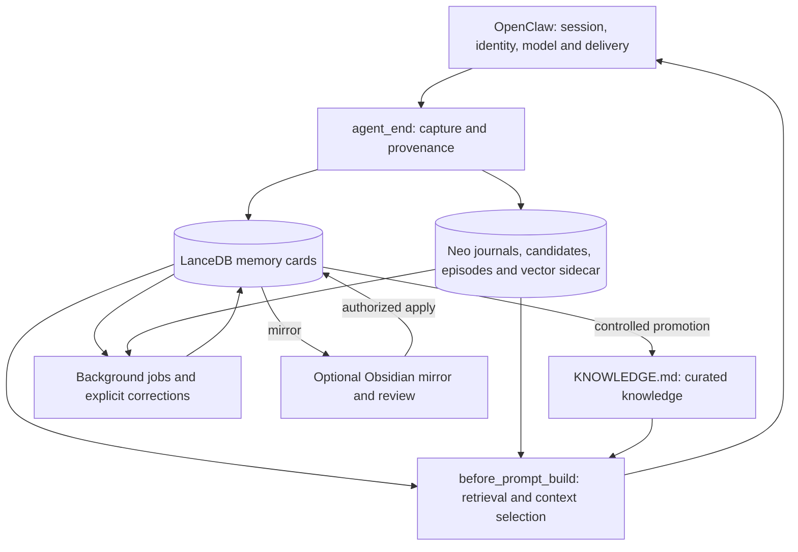

# PLUR1BUS — Memory plugin for OpenClaw

PLUR1BUS gives an OpenClaw agent persistent memory across conversations. It
captures selected conversation content, retrieves relevant evidence before a
reply, and maintains that evidence through corrections, validity windows,
consolidation and optional human review.

**Documentation baseline: PLUR1BUS 7.12.61, checked 2026-09-18.** The implementation
review used commit `c381fd57fd80df193bc615f405704132dd89884e`. Package metadata and
[source configuration](openclaw.plugin.json) remain authoritative when versions
change. Historical release notes and audits describe their own recorded builds.

## Start here

| Task | Documentation |
| --- | --- |
| Install and understand the main choices | This README |
| Daily use, corrections and troubleshooting (Deutsch) | [User guide](how-to-memory.md) |
| Understand storage, capture, lifecycle and security (Deutsch) | [System guide](how-to-memory-perfect.md) |
| Configure providers, profiles and defaults (Deutsch) | [Configuration reference](docs/configuration.md) |
| Follow the actual recall and ranking order | [Recall architecture](docs/recall-architecture.md) |
| Check limitations and confirmed findings | [Known issues](docs/known-issues.md) |
| Check host contracts and dated runtime evidence | [OpenClaw compatibility](docs/compatibility-openclaw.md) |
| Develop or validate a change | [Agent development guide](AGENTS.md) |
| Inspect release history | [Changelog](CHANGELOG.md) |

## Architecture



- **LanceDB** is authoritative for durable memory cards. The default flat route
  is `{baseDbPath}/{agentId}`. Named storage namespaces are an optional routing
  feature for the same agent; shared pools have a separate authorization model.
- **Neo** stores turn events, candidates, behavioral observations, episodes,
  graph relationships and recall history. Candidate vectors can live in a
  Float32 sidecar. Neo is not a second copy of the cards table.
- **KNOWLEDGE.md** holds curated knowledge and is searched by section. A
  successful promotion does not prove the factual truth of its content.
- **Obsidian**, when enabled and configured, exposes memory and review records
  to a person. Editing a mirror is not an unrestricted write to LanceDB.

Automatic capture is selective: the card path considers recent user and
assistant content, prioritizes up to three user URL/attachment contributions
and five text contributions, and prepares at most eight distinct texts. It is
not a lossless transcript archive. Assistant output remains assistant-sourced
material; stored content is not automatically verified fact.

Recall has a Neo context path and a primary card/canonical-knowledge path.
The primary path filters lifecycle and ACL eligibility, scores candidates,
expands authorized graph neighbors, optionally reranks, and merges namespaces
before final limits. Even a single namespace uses the merge wrapper. See the
[actual sequence and current reranking limitation](docs/recall-architecture.md).

## Runtime requirements

Use **Node.js 22.22 or newer**, with an exact package floor of **22.22.3**, and
also satisfy the selected OpenClaw release's Node requirements. The declared
OpenClaw floor is **2026.8.1 / plugin API >=2026.8.1**; the package and lockfile
build/test baseline is **OpenClaw 2026.8.2**. This is not a claim that every newer
host has passed a fresh end-to-end test.

The built-in `node:sqlite` module is available throughout the supported Node.js runtime range.
Optional local models require their own disk space, memory and model-license
acceptance. Remote embedding, reranking and chat providers are separate routes.

## Installation

Install a selected release through your configured registry, for example:

```bash
openclaw plugins install @cyb3rb1ade/plur1bus-memory@7.12.61 --pin
```

This registry command assumes that the selected version is available through
your configured `@cyb3rb1ade` scope. A source version alone is not publication
evidence. For a source build, install the generated package artifact:

```bash
npm ci --ignore-scripts
npm run lint
npm test
npm pack --ignore-scripts
openclaw plugins install npm-pack:/absolute/path/cyb3rb1ade-plur1bus-memory-7.12.61.tgz --force
```

`--ignore-scripts` here prevents the source checkout's `postinstall` cron
provisioner from contacting an existing gateway. It is not an instruction to
skip lifecycle work when installing OpenClaw itself. Keep the tarball and its
SHA-256 with the deployment record. Back up existing memory before an upgrade;
restart the gateway and verify the loaded plugin version afterward.

PLUR1BUS owns the host memory slot. Merge this entry into the existing host
configuration rather than replacing other plugin entries:

```json
{
  "plugins": {
    "slots": { "memory": "memory-lancedb-namespaced" },
    "entries": {
      "memory-lancedb-namespaced": {
        "enabled": true,
        "hooks": { "allowConversationAccess": true },
        "config": { "autoCapture": true, "autoRecall": true }
      }
    }
  }
}
```

Conversation-hook access is mandatory: the `before_agent_reply` admission guard
for direct feature crons needs it. Provider selection and credentials still need
to be usable on the host; an enabled entry is not proof of working embeddings.
See the [configuration reference](docs/configuration.md) for provider examples,
namespace constraints and the full plugin-entry example.

## Defaults and explicit profiles

Manifest defaults and an explicitly applied profile are different states.
Existing installations can retain their own settings.

| Feature | Manifest default |
| --- | --- |
| Automatic capture / recall; Neo | Enabled |
| Query refinement / Semantic Lens | Enabled; refinement is an empty-result fallback, lens needs its precomputed index |
| Conversation Reactivation Recall | Disabled |
| Reranker / merging / daily consolidation | Disabled |
| Skill Miner / Obsidian Bridge | Disabled |
| Critical push | Enabled flag; provisioning and delivery still require explicit gates and a valid route |
| Persona / dream echo / afterthought | Enabled flags; execution still depends on data, routes and scheduling |
| Model-facing destructive memory operations | Allowed; disable explicitly if unwanted |

- `/plur1bus setup` lists available profile choices without writing configuration.
- `/plur1bus start` shows read-only status and onboarding guidance.
- `/plur1bus setup safe` explicitly applies the Safe profile.
- `/plur1bus setup recommended` explicitly enables additional features while
  retaining the profile's write-safety gates and preserved opt-outs.

Reranker timeout: default 5s, with fallback controlled by its configuration.
`merging.autoApply` defaults to `false`; review and apply are separate actions.
Obsidian starts disabled; enabled reviews marked `pending_setup` still require
setup. Discovery of a vault does not confirm it. Skill auto-apply has its own
`skillMiner.autoApply` policy and can follow the host's autonomous Workshop mode;
not every generated proposal is necessarily manual-only.

An explicit override example for one internal chat feature is
`emotion.t3.model: "gpt-4o-mini"`. That is an illustrative choice, not an inherited
chat-model selection. The complete routing contract follows below.

## Commands and model tools

| Command | Purpose |
| --- | --- |
| `/state` | Inspect status and diagnostics |
| `/memory <query>` | Search; `--explain` adds decision information |
| `/forget <text>` | Authorized, archive-first forgetting workflow |
| `/correct <old> zu <new>` | Authorized correction with a new embedding/version |
| `/mf <id> +`, `-`, `~` | Record feedback on a memory result |
| `/share <id>` | Confirm and copy to the workspace shared pool |
| `/share <id> --user` | Confirm and copy to the authenticated user's shared pool |
| `/enable <feature>` / `/disable <feature>` | Change supported feature settings |
| `/plur1bus skills review` | Review skill proposals |
| `/plur1bus reminders list` | Inspect reminder state |
| `/plur1bus doctor` | Inspect diagnostic findings |

The model tools `memory_store`, `memory_recall`, `memory_search`, `memory_forget`
and `knowledge_update` are separate entry points. Chat confirmations and chat
allowlists must not be assumed to govern every tool. In particular,
`security.allowModelDestructiveMemoryOps` defaults to `true`.

Sharing is **copy, never move**. Pools use
`.plur1bus-shared/workspaces/w-<62hex>` and
`.plur1bus-shared/users/u-<62hex>`; authenticated context controls visibility.
`workspace_shared legacy rows are not reinterpreted` automatically: the explicit
migration path is documented in [configuration](docs/configuration.md).

## Background work and operator UI

The **PLUR1BUS** tab uses OpenClaw's gateway and authentication at
`/plugins/memory-lancedb-namespaced/control`. It shows memory, provider, workspace,
model-preparation and migration state. Write controls require both configured
`controlUi.writeActions` and host operator permissions.

The cron provisioner reads validated `config.get` source/runtime views and
requires native command dispatch. Raw source settings gate provisioning;
manifest defaults alone do not create jobs. Exact feature commands execute
without an outer carrier-model turn. OpenClaw owns final delivery. Setup does
not change the OpenClaw default LLM or per-agent credentials.

`node scripts/setup-feature-crons.mjs` can create or update jobs. It is not a
read-only status command, and its install-safe exit code does not prove that
all jobs were provisioned. Inspect reported skips, the host's cron state and
actual run results. Schedules and gates are explained in the
[user guide](how-to-memory.md).

## OpenClaw chat-LLM routing


Chat models are selected per owning feature. If an optional feature `model` is
absent, PLUR1BUS uses the effective OpenClaw agent model and sends no `model`
property. Features never inherit `merging.model`, its endpoint, credential, or
headers. Existing feature/profile activation, budgets, confirmation gates,
rate limits, and fail-soft behavior remain unchanged; Safe produces zero
PLUR1BUS native/direct chat calls.

The four selection modes are `openclaw-default` (native with no model),
`openclaw-override` (feature-local model through OpenClaw), `direct-override`
(feature-local model plus direct transport), and `unavailable`. `failed` is the
stable diagnostic outcome when a selected transport rejects. Provider/model
metadata returned by OpenClaw may be recorded without credentials, prompts, or
headers. Native routes bypass the PLUR1BUS result cache; complete direct routes
retain exact caching.

Direct transport without a feature-local model fails closed and sends no
request. A configured credential that is unresolved is unavailable; it never
falls through to native OpenClaw host credentials and does not abort plugin
registration. `runtime.llm.complete` missing or unavailable is fail-soft and
does not select a hard-coded model.

A session-bound command capability omits `agentId`. Global hook, tool, and
background calls retain the target agent and require entry-level
`llm.allowAgentIdOverride:true`. A model-only native override requires
`llm.allowModelOverride:true` and obeys `allowedModels`. Installer `preserve`
never grants LLM trust, and neither Safe nor Recommended adds those entry-level
bits.

`runtime.llm.complete` resolves the effective primary selection and does not
execute the configured model fallback array in the installed runtime. PLUR1BUS
neither claims nor emulates a host fallback chain.

## Trust, deletion and current limits

Cards have independent lifecycle, epistemic and real-world-validity fields.
`createdAt` is capture time; `validFrom` / `validUntil` describe when a claim
holds; `expiresAt` controls technical expiry. Explicit `validAt` queries apply
validity windows; omitting it does not mean "valid now".

Private cards belong to the agent and may be recalled across its workspaces.
Workspace and user scopes need their corresponding context. High retrieval
scores never confer access. Host search without a full session is restricted;
its direct card-read adapter is a distinct path and does not inherit every
recall filter.

Forgetting prevents normal active use and exact normalized re-ingestion through
tombstones. It does not erase all journals, archives, exports and backups.
Memory evidence is escaped and framed as historical context, not a new command.
These controls do not establish universal prompt-injection resistance.

The reviewed source has two isolated reproductions: a global merge can undo a
reranker's ordering, and a critical-classifier batch can exceed its configured
daily push limit. There are also static dry-run contract limits. See
[known issues](docs/known-issues.md) before relying on these behaviors.

## Development and verification

The package is ESM JavaScript with no compilation step for the plugin itself.

```bash
npm ci --ignore-scripts
npm run lint
npm test
```

`npm test` includes both `tests/*.test.js` and `test/*.test.js`, serialized by the
Node test runner. The suite includes pure helpers, mocked providers, native
LanceDB, filesystem/capability checks, worker/IPC and host integration contracts;
it is not DB-free. Platform prerequisites can cause skips.

At the reviewed commit, the 2026-09-18 macOS / Node 22.23.2 run completed with
4,684 passes, 0 failures and 76 skips (4,760 tests, 849 suites). This is a dated
source-suite result, not a production-installation or recall-quality benchmark.
The production dependency audit reported no known vulnerabilities at that time;
it is not a guarantee about future advisories or application security.

## License

Plugin source: [MIT](LICENSE). Optional model artifacts have separate licenses;
consult the pinned artifact definitions and model terms before selecting them.
