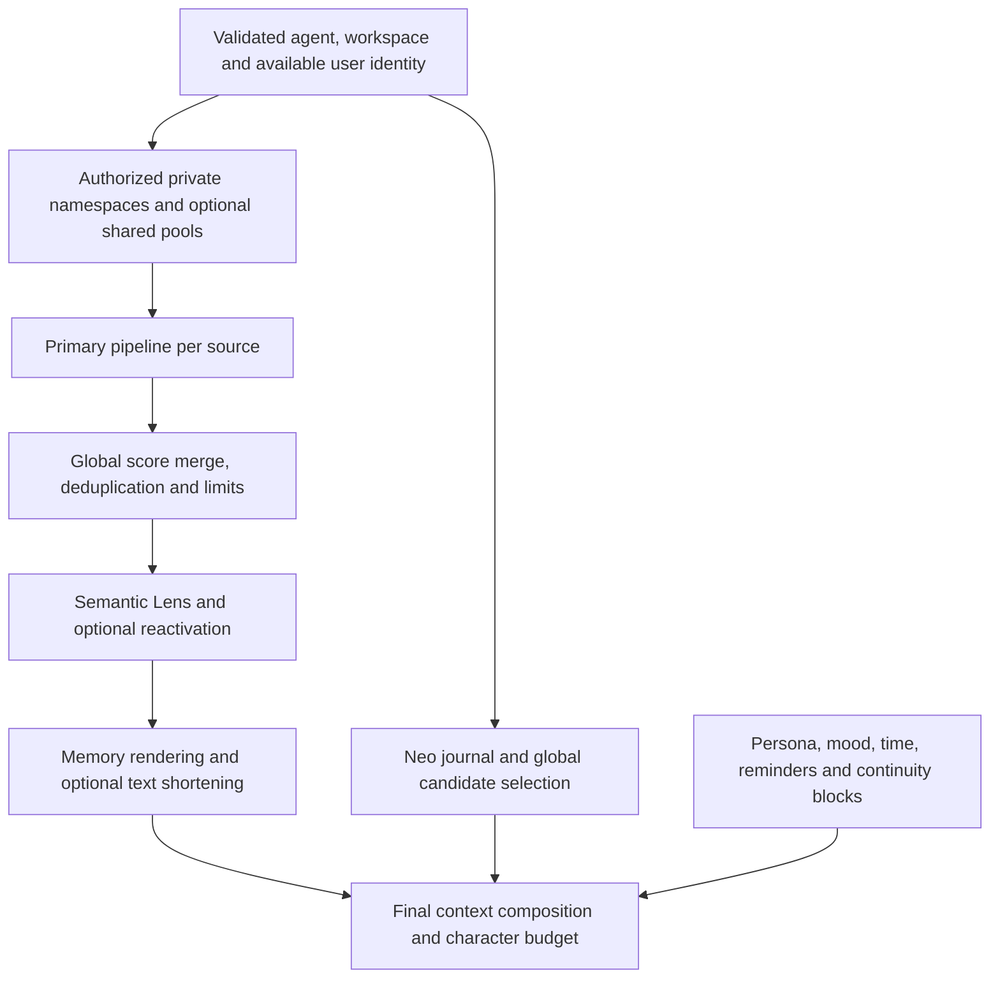

# Recall architecture: implemented runtime behavior

Checked against PLUR1BUS 7.12.61, commit
`c381fd57fd80df193bc615f405704132dd89884e` (2026-09-18). This page describes
reachable call paths, not just available helpers. Configuration values below
are manifest defaults unless stated otherwise.

## Entry points are different contracts

| Entry point | Context and behavior |
| --- | --- |
| `before_prompt_build` | Neo context plus primary recall; combines additional prompt blocks afterward |
| `memory_recall` / `memory_search` | Explicit card/canonical retrieval with tool context and optional `validAt` |
| `/memory` | Chat command with its own authorization and query handling |
| Host memory `search` | Restricted agent-private adapter; no workspace canonical search, graph associations or query refinement |
| Host memory `readFile` for a card | Direct `getCard` path; not a replay of the search pipeline's context and eligibility checks |

Source: [hook/tool orchestration](../index.js),
[host adapter](../lib/setup/memory-host-runtime.js),
[chat memory command](../lib/telegram-commands/memory-query.js).

## Automatic context assembly



Neo is a separate context path. The hook reads bounded recent candidates and
behavior cards, and can query the wider candidate index over the vector
sidecar. Query embedding has its own budget; failure can leave lexical
selection available. Neo output carries memory/provenance labels. Its candidate
score is not interchangeable with the card pipeline's score.

The primary runtime always uses `runMergedNamespaceRecall`, even when only one
database is available. Each child receives `deferFinalCap: true`. Therefore a
standalone call to `runRecallPipeline` with default options is not an accurate
model of the live caller's final order or item cap.

Sources: [Neo](../lib/neo-arch.js), [runtime wrapper](../index.js),
[pipeline and merge](../lib/recall-pipeline.js).

## Primary pipeline within each source

1. **Embed the query.** Use the selected embedding provider and compatible
   generation. Exact caches may avoid a provider call. A very long query can
   be summarized through an available caller-supplied summarizer or shortened.
2. **Search LanceDB.** `recall.candidateTopK` defaults to 40; the pipeline also
   has a hard candidate cap of 100. The card path is vector retrieval, not a
   universal lexical/BM25 search over every workspace file.
3. **Filter score, lifecycle and ACL eligibility.** Invalidated, inactive,
   expired or unauthorized rows must not survive simply because they are close
   vectors. Int64-backed fields are projected into safe numeric values.
4. **Refine only an empty eligible result.** With
   `recall.queryRefinerEnabled: true`, the deterministic refiner removes
   stopwords and applies a fixed synonym map. It runs when no candidates remain
   after the preceding gates, not on every vaguely relevant result. The public
   tool and automatic hook wire it; the restricted host adapter disables it.
5. **Apply time semantics.** Explicit `validAt` filters claim-validity windows.
   Otherwise recognized natural-language time can filter `createdAt`; that
   legacy filter falls back to the unfiltered set if it would remove everything.
6. **Search canonical knowledge.** The first configured source can embed and
   search sections of `KNOWLEDGE.md`. These are canonical section results, not
   additional rows in the card database. `canonicalMinScore` defaults to 0.30;
   `canonicalMaxItems` defaults to 5.
7. **Adjust card scores.** Importance, emotional intensity, memory strength and
   epistemic state contribute heuristics. They are not truth probabilities.
8. **Expand and hydrate the graph.** The live path builds a graph index and
   queries bounded neighbors, then loads eligible cards. Both endpoints and
   hydrated rows must satisfy context/lifecycle checks. Defaults are depth 2,
   8 neighbors per node and 40 associated recalls.
9. **Optionally rerank.** An enabled, available reranker can reorder the expanded
   candidate list. Timeout/failure behavior follows its configured fallback.
10. **Recheck ACL and return the child result.** The live caller defers final
    item capping and deduplication to the global merge. The standalone pipeline
    also has a budget/finalization branch, which is skipped under this flag.

Sources: [pipeline](../lib/recall-pipeline.js),
[query refiner](../lib/query-refiner.js),
[graph index](../lib/graph-index.js), [memory graph](../lib/memory-graph.js),
[ACL](../lib/acl-middleware.js).

## Namespace and shared-source merge

Without `namespaces`, storage retains the flat `{baseDbPath}/{agentId}` route.
An explicit layout selects same-agent read partitions and one active writer.
Read-only legacy tables are not created or migrated. Namespace labels decorate
results; they do not replace ownership fields or grant sharing rights.

Children settle before the result is exposed. A genuinely missing optional
legacy table can be skipped. Required private-source initialization/query
failures reject strict recall. Optional shared sources have a different
contract: a failed shared read may be warned about and omitted while private
results remain available. Do not generalize either rule to every source.

The merge deduplicates canonical sections, collapses duplicate card identities,
and optionally removes near-duplicate texts. Known disjoint validity windows
must not be collapsed merely because text matches. It then applies the combined
canonical/card limit. `recall.maxPromptMemories` defaults to 12, including up to
5 canonical results; explicit tool limits can differ. Optional adaptive
core/project/association budgets run after the merge in the live caller.

A retrieval-ledger entry records selected cards. Later prompt shortening and
model behavior mean that selection is not proof a card influenced the answer.

### Current reranking limitation

At the reviewed version, the child preserves the reranker's order but does not
assign a new score to represent that ordering. The global merge sorts by the
previous numeric scores. It can therefore undo the reranker's order, including
in a single-source call. An isolated two-card reproduction returned A > B,
then B > A after reranking, then A > B after merge. It used real pipeline/merge
functions with stub providers and synthetic authorized records; no production
memory or live inference was involved.

This is distinct from historical provider-scoring fixes. Enabling reranking is
not evidence that the final delivered list follows the reranker. See
[known issues](known-issues.md#reranker-order-can-be-lost-during-global-merge).

## Score model

For an ordinary vector candidate, before graph and later selection stages:

```text
base = 1 / (1 + distance)
score = (base + (importance - 0.5) * importanceBoost) * emotionFactor
        + (memoryStrength - 1) + epistemicBoost
```

`importanceBoost` defaults to 0.3; the emotion factor is bounded to 0.9–1.1.
Epistemic boosts are trusted +0.25, corroborated +0.15, observed 0,
untrusted -0.15 and disputed -0.4. Invalidated rows are excluded. A missing
legacy status is neutral for ranking even though security normalization calls
it untrusted. Strength is additive, so it can materially change rank.

Canonical sections use cosine similarity. Neo additionally considers lexical
Jaccard overlap, vector similarity, category, provenance, curation, salience,
recency and conflict state. Comparing those numbers as a universal confidence
scale is incorrect.

Sources: [score](../lib/score.js),
[epistemic status](../lib/epistemic-status.js), [Neo](../lib/neo-arch.js).

## Three independent clocks

| Field / option | Meaning |
| --- | --- |
| `createdAt` / `updatedAt` | When the system captured or changed the record |
| `validFrom` / `validUntil` | When the claim is known to hold in the real world |
| `expiresAt` | Technical expiry; expired cards are ineligible for recall |
| `validAt` | Optional query time for claim validity |

Validity is left-inclusive/right-exclusive. Zero means an unknown/open bound,
not the Unix epoch. No `validAt` means no implicit "valid now" filter; historical
cards can remain eligible and carry visible validity labels. Both Number and
safe BigInt representations are handled. Existing legacy tables missing the
validity columns have a narrow retry-and-filter path; unrelated query errors do
not trigger it. [Validity implementation](../lib/valid-time.js),
[legacy temporal filter](../lib/temporal-filter.js).

## Additive recall and prompt limits

**Semantic Lens** defaults to enabled. It reads a precomputed workspace index,
adds deduplicated community/bridge/faded cards under caps, and falls back without
replacing primary recall. An enabled flag alone does not create that index.
**Conversation Reactivation Recall** defaults to disabled. It adds a bounded
reactivation block based on continuity triggers. Both have a default 50 ms
budget and do not mutate cards as a side effect of recall.

The caller also wires `recall.semanticCompression.enabled` (default false).
Despite the name, this path uses deterministic text shortening and an
approximate slot budget; it is not an additional LLM summarization pass.

A later `recall.globalInjectMaxChars` budget defaults to 17,000 characters.
Selected blocks can be shortened or dropped. Protected time/reminder blocks
can exceed the nominal cap. It is neither an exact token count nor a universal
limit on the full host prompt, which includes context outside PLUR1BUS.

Recalled text is framed as quoted historical evidence. Confidence framing can
mark weak matches as uncertain. Neither is a proof that the model will always
interpret the evidence correctly.

Sources: [Semantic Lens](../lib/semantic-lens-index.js),
[reactivation](../lib/conversation-reactivation-recall.js),
[injection budget](../lib/inject-budget.js),
[confidence framing](../lib/recall-confidence-framing.js),
[text shortening](../lib/text-utils.js).
