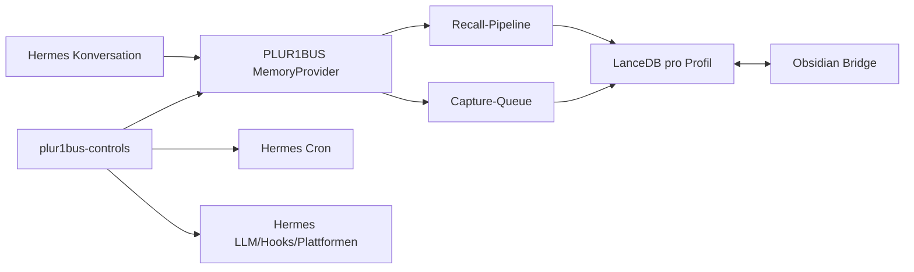

# PLUR1BUS vollständig auf Hermes portieren

**Date:** 2026-07-25  
**Goal:** Vollständige PLUR1BUS-Featureparität auf Hermes (v0.19.0 Mindestversion) mit zwei Python-Komponenten im selben Repo wie OpenClaw-Adapter und separatem Runtime-Pfad.

## Architektur-Zielbild

PLUR1BUS wird vollständig in einem gemeinsamen Repository geführt:

- Der bestehende JavaScript-Adapter bleibt als OpenClaw-Referenz und für Paritätstests erhalten.
- Die Hermes-Implementierung ist vollständig Python-basiert; für die Hermes-Runtime darf kein Node-Prozess nötig sein.
- Zwei Hermes-Komponenten:
  - `plur1bus` als exklusiver Memory-Provider (`provider: plur1bus`).
  - `plur1bus-controls` für Slash-Commands, Hooks, LLM-Bridge, Wartungsjobs und Cron-Integration.
- `Hermes session history` und `Hermes built-in memory` bleiben in Kraft, aber als reine Session-/FTS-Schicht: PLUR1BUS bleibt der dauerhafte persistenten Speicher.



## Feature-Entscheidungslogik

| Bereich | Hermes-Status | Entscheidung |
|---|---|---|
| MEMORY.md / USER.md / Memory-Tool | Einfaches Text-Memory | **Deaktivieren** (`memory_enabled: false`, `user_profile_enabled: false`). |
| Externer Memory-Lifecycle (Prefetch, Turn-Sync, Session-/Compression-/Delegation-Hooks) | vorhanden | **Als Adapter-Schnittstelle nutzen**. |
| Session-Historie/FTS | vorhanden | **Nativ verwenden**. |
| Skills / /learn / Skill-Freigabe | vorhanden | **Nicht portieren**: bestehende Skills migrieren. |
| Cron / Reminder / Wiederkehrende Aufgaben | vorhanden | **Hermes-Cron verwenden**, PLUR1BUS-Scheduler nicht portieren. |
| Modellzugriff / Credentials / Fallback | vorhanden | **`ctx.llm` nativ verwenden**, PLUR1BUS-LLM-Result-Cache beibehalten. |
| Plattform-/Gateway-/Hook-Framework | vorhanden | Als Harness nutzen. |
| LanceDB, Capture, Recall, ACL, Sharing, Graph, Emotionen, Verweisschutz, Träume, CRR, Semantic Lens, Obsidian usw. | ungleichwertig / nicht vorhanden | **Vollständig portieren**. |

## Zielkonfiguration (Installer)

Der Hermes-Installer erzeugt mindestens diese Sektion:

```yaml
memory:
  memory_enabled: false
  user_profile_enabled: false
  provider: plur1bus
  plur1bus:
    dataDir: "<HERMES_HOME>/plur1bus"
    # weitere bestehende PLUR1BUS-Konfigurationsfelder bleiben erhalten

plugins:
  enabled:
    - plur1bus-controls
```

- Bestehende PLUR1BUS-Userwerte bleiben kompatibel.
- Neue Installationen erhalten weiterhin Full-Experience-Defaults.
- Secrets werden nicht kopiert; statt dessen werden Credential-Referenzen geschrieben.
- Cutover bricht, wenn erforderliche Embedding-Zugangsdaten fehlen.

## Implementierung (konkrete Arbeitspakete)

### A) Python-Core und Verträge

- [ ] Neues Python-Paket `plur1bus-hermes` erstellen.
- [ ] `pyproject.toml` und minimale Repo-Layout-Änderungen hinzufügen.
- [ ] JSON-Schemas/Golden-Fixtures als sprachneutrale Vertragsgrenze zwischen JS- und Python-Pfad einführen.
- [ ] Persistenz-Schema, IDs, Statuswerte, Typen, Cache-Keys, Frontmatter unverändert halten.
- [ ] Validation-Äquivalente für `safeAgentId`, `resolveInside`, Enum- und Längenbegrenzungen in Python implementieren.
- [ ] Python-LanceDB auf feste kompatible Version (Start: `lancedb==0.34.0`) pinnen.

### B) Hermes MemoryProvider (`plur1bus`)

- [ ] `Plur1busMemoryProvider` implementieren mit mindestens:
  - `initialize()`
  - `system_prompt_block()`
  - `prefetch()`
  - `sync_turn()`
  - `on_pre_compress()`
  - `on_session_end()` / `on_session_switch()` / `shutdown()`
  - `on_delegation()`
  - `backup_paths()`
  - `get_tool_schemas()` / `handle_tool_call()`
- [ ] Additive Ergebnisse (Semantic Lens, CRR) in der Prefetch-Pipeline integrieren.
- [ ] Queue-/Shutdown-Verhalten non-blocking, backpressured und idempotent gestalten.

### C) Hermes Controls (`plur1bus-controls`)

- [ ] Gemeinsamen Service-Container initialisieren.
- [ ] Host-Adapter auf `ctx.llm` als Standard-LLM.
- [ ] Hooks für Session-/LLM-/Tool-Events registrieren.
- [ ] `/plur1bus`-Oberfläche als Kanonischeinschicht mit Unterkommandos bereitstellen: `start`, `status`, `memory`, `forget`, `correct`, `feedback`, `share`, `features`, `graph`, `dreams`, `obsidian`, `reminders`, `jobs`, `doctor`, `migrate`.
- [ ] Alias-Registrierung für `/forget`, `/correct`, `/mf`, `/share` nur bei Bedarf (wenn Hermes diese Kommandos nicht schon bindet).
- [ ] `/memory`, `/state`, `/enable`, `/disable` nicht überschreiben.
- [ ] Bestätigungen weiterhin an `user+chat+nonce` binden; Destruktionspfade archiv-first + auditpflichtig lassen.

### D) Vollständige Migration (kein Direktbetrieb auf produktivem OpenClaw-Store)

- [ ] `plur1bus-hermes migrate --dry-run` für Inventarisierung und Validierung implementieren.
- [ ] Snapshot-Vorbereitung + Abschaltung laufender OpenClaw-Schreibvorgänge + Ownership-Lock vor jeglicher Übernahme.
- [ ] Mapping für Mehragenten-Profile erzwingen (einfacher 1:1-Mapping nur bei genau einem Alt-Agenten).
- [ ] Lesen aus Snapshot-Kopie, Schreiben in neue Hermes-Pfade.
- [ ] IDs, Inhalte, Vektoren, Status, ACL, Graph, Emotionen, Träume, Archive deterministisch übernehmen.
- [ ] ANN-/Semantic-Lens-/Link-Indizes neu berechnen statt alte Laufzeitindices blind zu übernehmen.
- [ ] Cache-Übernahme nur kompatibel; inkompatible Einträge in Migrationsarchiv ablegen und neu berechnen.
- [ ] Reminder in Hermes-Cron-Jobs konvertieren; alte Skill-States in Hermes-kompatible `SKILL.md` überführen.
- [ ] Offene Nonces invalidieren und im Manifest ausweisen.
- [ ] Obsidian-Vault-Managed-Blocks/Hashes verifizieren statt neu generieren.
- [ ] Cutover erst bei fehlerfreiem Manifest.
- [ ] Rückfallpfad: Alt-Store und Snapshot unverändert lassen.

### E) Test- und Abnahmekonzept

#### Unit- und Kompatibilitätsprüfung

- [ ] JS- und Python-Suite weiterhin grün.
- [ ] Python-Unit-Tests für jedes portierte Kernmodul.
- [ ] Sprachübergreifende Golden-Fixtures (ACL, Recall, Recall-Reihenfolge, Graph, Emotionen, Cache-Keys, Serialisierung).
- [ ] Provider-Integrationstests für Prefetch/Capture/Compression/Sessionwechsel/Delegation/Shutdown/Timeout/Fallback.
- [ ] Security-Tests: Path Traversal, ungültige IDs/Enums, Gruppen/Chat-Typ-Autorisierung, Identitätswechsel, Replay.
- [ ] Jobtests für Idempotenz, Restart-Verhalten, Delivery-/Cron-Workflows.
- [ ] Obsidian-Tests für bidirektionalen Sync, Managed Blocks, Konfliktschutz.

#### E2E-Abnahme

- [ ] Kein Node-Prozess für Hermes-PLUR1BUS erforderlich.
- [ ] Built-in Hermes-Memory bleibt deaktiviert und PLUR1BUS ist aktiver Provider.
- [ ] End-to-end: auto-capture -> LanceDB + Obsidian -> Recall in Folgesession.
- [ ] Isolation (Agent/Workspace/User/Chat), Sharing, Korrektur, Vergessen, Feedback, Graph, CRR, Semantic Lens, Emotionen, Träume, Consolidation, Critical Push laufen in E2E.
- [ ] Vollständiger Backup-/Rollback-Run in Testinstallation bestanden.
- [ ] `/plur1bus status` zeigt mindestens: konfiguriert / verfügbar / E2E funktionsfähig.
- [ ] CI: verbindlich gegen Hermes `v0.19.0`, informativ gegen Hermes `main`.

### F) Rollout-Reihenfolge (feste Reihenfolge)

1. Vertrags-/Fixture-Freeze des aktuellen JS-Standes.
2. Python-Domain-Kern, Validierung, LanceDB, Caches.
3. Capture-/Recall-Parität.
4. Graph/Dynamik/Emotion/Traum/Obsidian.
5. Controls-Plugin + Native Cron.
6. Voller Migrator + Skill-/Reminder-Konverter.
7. Read-only Shadow-Recall gegen Snapshot.
8. Pilotprofil mit realen Hermes-Sessions.
9. Cutover nach erfolgreicher E2E-, Migrations- und Rollback-Abnahme.

## Risiken / harte Entscheidungen

- Node darf für PLUR1BUS in Hermes nicht mehr benötigt werden (Runtime-Fakt). 
- PLUR1BUS bleibt der einzige persistente Memory-Pfad.
- `/plur1bus` als kanonische Oberfläche.
- No parallel writers zwischen OpenClaw/Hermes während Migration.
- Kein automatischer Cutover bei Validierungsabweichungen.
