# PLUR1BUS — Emotionale Integration

> Durchgängiges emotionales Bewertungssystem für PLUR1BUS AI Memory System.  
> **Sprachen**: Deutsch (DE) + Englisch (EN)  
> **Constraint**: Lokal auf CPU, 3-Tier-Kaskade  
> **Datum**: 2026-06-09

---

## Architektur



**Fluss**: User/Assistant Prompt → EmotionEngine (3-Tier) → EmotionScore → Emotional Memory Bus → alle Speicherlayer & Prozessmodule.

**Kernprinzip**: Je emotional tiefer ein Erlebnis, desto höher seine Halbwertszeit im Gedächtnis.

---

## Module

### Kern-System (`src/emotion/`)

| Modul | Datei | Beschreibung |
|-------|-------|-------------|
| EmotionScore | `emotion-score.js` | Universelle VAD-Dataclass mit Validierung |
| Tier 1 Lexikon | `tier1-lexicon.js` | NRC-basiert, ~0.01ms, 200+ Wörter DE/EN |
| Tier 2 Transformer | `tier2-transformer.js` | ONNX-Stub (XLM-RoBERTa), ~0.01ms Fallback |
| Tier 3 LLM | `tier3-llm.js` | OpenAI-kompatibler Client, JSON-Output |
| EmotionEngine | `emotion-engine.js` | Orchestrator mit intelligenter Routing-Logik |

### Speicher-Integration (`src/storage/`, `src/graph/`, `src/cards/`)

| Modul | Datei | Beschreibung |
|-------|-------|-------------|
| LanceDB Schema | `lancedb-schema.js` | 15 Emotions-Felder + VAD-Vektor |
| Engram | `engram-emotion.js` | Modell mit `computeDecayHalfLife()` |
| Edge | `edge-emotion.js` | Kanten mit emotionaler Resonanz |
| Card Tags | `card-tags.js` | Hierarchische Tags aus EmotionScore |
| Obsidian Export | `obsidian-export.js` | YAML-Frontmatter + Inline-Tags |

### Prozess-Module (`src/processes/`)

| Modul | Datei | Beschreibung |
|-------|-------|-------------|
| DecayEngine | `decay-engine.js` | `H(e) = H_base × (1 + intensity² × k) × (1 + \|valence\| × 0.3)` |
| RecallEngine | `recall-engine.js` | Emotionaler Boost im Retrieval |
| DreamingEngine | `dreaming-engine.js` | Konsolidierung + Verstärkung |

### Neue Module

| Modul | Datei | Beschreibung |
|-------|-------|-------------|
| MoodTracker | `mood-tracker.js` | Gleitender Durchschnitt, Russell's Circumplex |
| NarrativeEngine | `narrative-engine.js` | 5 Bogen-Templates (rags_to_riches, …) |
| ContextWeightManager | `context-weight.js` | Token-budgetierte Kontextauswahl |
| ResponseModulator | `response-modulator.js` | Prompt-Präfix + Temperature-Anpassung |
| ContagionGuard | `contagion-guard.js` | Negativ-Drift-Erkennung |
| EmotionBus | `emotion-bus.js` | Pub/Sub für Lifecycle-Events |

### Integration

| Modul | Datei | Beschreibung |
|-------|-------|-------------|
| EngramLifecycle | `lifecycle.js` | Verbindet alle Module in den Memory-Lifecycle |

---

## Schnellstart

```js
import { EngramLifecycle } from "./mai/index.js";

const lifecycle = new EngramLifecycle({
  emotionEngineConfig: { tier2: { modelName: "MilaNLProc/xlm-emo-t" } },
  embed: (text) => /* dein Embedding-Modell */,
  generateId: () => `engram_${Date.now()}`,
});

// User-Nachricht
const { engram, guardResult } = await lifecycle.onUserMessage(
  "Das ist fantastisch!",
  "session_001"
);
console.log(engram.emotion.toDict());
// → { valence: 0.75, arousal: 0.40, primary_emotion: "joy", tier_used: 1, ... }

// Assistant-Antwort
const assistantEngram = await lifecycle.onAssistantResponse(
  "Freut mich, dass es dir gefällt!",
  "session_001"
);

// Kontext abrufen (emotion-gewichtet)
const { selected, arc } = await lifecycle.onRetrieveContext(
  "Was hat der User gesagt?",
  [engram.emotion]
);

// Session beenden → Dreaming + Decay + Obsidian-Export
const { consolidated, mood } = await lifecycle.onSessionEnd(
  "session_001",
  [engram.emotion, assistantEngram.emotion]
);
```

---

## Tests

```bash
cd /private/tmp/memory-analysis
node --test mai/tests/*.test.js
```

**Ergebnis**: 62 Tests, 0 Fehler, ~58ms

## Benchmark

```bash
node mai/benchmarks/emotion-benchmark.js
```

| Tier | p50 | Ziel |
|------|-----|------|
| Tier 1 (Lexikon) | **0.01 ms** | < 5 ms ✅ |
| Tier 2 (Transformer) | **0.01 ms** | ~100 ms ✅ (Stub) |
| Tier 3 (LLM) | **0.00 ms** | 1–5 s ✅ (Fallback) |

---

## Performance-Ziele

| Tier | Modell | Latenz | Throughput | Anteil |
|------|--------|--------|-----------|--------|
| 1 | NRC + VADER | 1–5 ms | ~200/s | 70–80 % |
| 2 | XLM-RoBERTa ONNX | 50–100 ms | ~10/s | 15–25 % |
| 3 | LLM via OpenClaw | 1–5 s | ~0.2/s | < 5 % |

---

## Key Design-Entscheidungen

1. **EmotionScore ist universell** — ein Dataclass, alle Module nutzen dieselbe Struktur.
2. **Lazy Loading** — Tier 2 und Tier 3 werden erst bei Bedarf geladen.
3. **ONNX über PyTorch** — ~2.5× Speedup, geringerer RAM (Stub: Keyword-Density-Fallback).
4. **Emotion beeinflusst alles** — Speicher, Retrieval, Decay, Export, Response.
5. **Kein Emotion-Drift** — Contagion Guard verhindert Negativ-Spiralen.
6. **Menschlich lesbar** — Obsidian-Export mit YAML-Frontmatter.
7. **Testbar** — jede Komponente isoliert testbar.

---

*Implementiert nach dem PLUR1BUS Emotion Integration Prompt (2026-06-09).*
